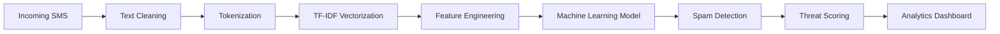

<div align="center">

# 🛡️ SPAMSHIELD AI

### Next-Generation AI Powered SMS Security Platform


<br>


---

## 🚀 Vision

SpamShield AI is a production-ready cyber intelligence platform designed to identify spam, phishing attempts, fraud campaigns, and malicious SMS content using Natural Language Processing and Machine Learning.

Unlike traditional spam filters, SpamShield AI combines intelligent text vectorization, statistical learning algorithms, analytics dashboards, and cybersecurity-inspired monitoring to provide a complete SMS threat detection ecosystem.

---

# 🌌 Core Intelligence Pipeline



---

# ⚡ Enterprise Features

### 🤖 Artificial Intelligence Engine

* Machine Learning Classification
* NLP Processing Pipeline
* TF-IDF Vectorization
* Confidence Score Estimation
* Threat Intelligence Scoring

### 🔒 Cyber Security Layer

* Fraud Detection
* Phishing Identification
* Scam Monitoring
* Suspicious Content Analysis
* Risk Classification

### 📊 Business Intelligence Dashboard

* Real-Time Monitoring
* Spam Analytics
* Historical Insights
* Prediction Tracking
* Detection Statistics

### 📂 Enterprise Bulk Scanner

* Batch SMS Analysis
* CSV Upload Support
* Mass Classification
* Exportable Reports
* Threat Summaries

### ☁ Advanced NLP Insights

* Interactive Word Clouds
* Keyword Intelligence
* Message Distribution Analysis
* Text Pattern Recognition
* Spam Vocabulary Detection

---

# 📈 Model Performance

| Metric    | Score |
| --------- | ----- |
| Accuracy  | 97.1% |
| Precision | 100%  |
| Recall    | 79.3% |
| F1 Score  | 88.4% |

---

# 🧠 AI Architecture

```text
User SMS
   │
   ▼
Preprocessing
   │
   ▼
Stopword Removal
   │
   ▼
Stemming
   │
   ▼
TF-IDF Encoding
   │
   ▼
Multinomial Naive Bayes
   │
   ▼
Spam Probability
   │
   ▼
Threat Assessment
   │
   ▼
Dashboard Visualization
```

---

# 🛠 Technology Ecosystem

### Frontend

* Streamlit
* Plotly
* HTML
* CSS

### Artificial Intelligence

* Scikit-Learn
* TF-IDF
* Naive Bayes
* NLP

### Data Processing

* Pandas
* NumPy
* NLTK

### Visualization

* Plotly
* Matplotlib
* WordCloud
---

# 👨‍💻 Developer

## Archit Deep

### AI Engineer • Full Stack Developer • Cyber Security Enthusiast

Focused on building intelligent systems that combine Machine Learning, Artificial Intelligence, Natural Language Processing, and modern web technologies to solve real-world problems.

---

# 🔮 Future Roadmap

* Deep Learning Models
* BERT Spam Detection
* GPT Assisted Classification
* WhatsApp Scam Detection
* Email Threat Detection
* Mobile Application
* Real-Time REST API
* Cloud Deployment
* Threat Intelligence Engine

---

<div align="center">

# ⭐ SpamShield AI

### Intelligent SMS Security for the Modern World

Built with ❤️ by Archit Deep

</div>

